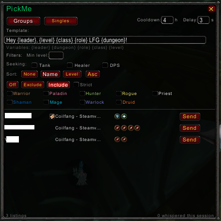

# PickMe

If you find this useful, consider [supporting development](https://www.paypal.com/donate/?hosted_button_id=FG4KES3HNPLVG).

Other addons:
- [LazyProf](https://www.curseforge.com/wow/addons/lazyprof) - Profession leveling optimizer
- [CraftLib](https://www.curseforge.com/wow/addons/craftlib) - Recipe database
- [Silencer](https://www.curseforge.com/wow/addons/silencer-whispers) - Whisper gatekeeper
- [VendorSniper](https://www.curseforge.com/wow/addons/vendorsniper) - Vendor restock sniper

LFG listing browser for World of Warcraft Classic. Browse groups and solo players from the LFG tool, filter by class, role, and level, then send templated whispers with one click.

List yourself in LFG, and PickMe shows everyone else looking - split into Groups and Singles tabs. Filter down to exactly the listings you care about, customize your whisper message, and reach out without typing a thing.

## Screenshots

## Features

- **Groups and Singles tabs** - Browse multi-member groups and solo players separately, each with independent filters and templates
- **Class filters** - Exclude or include specific classes, with strict mode for groups (all members must match)
- **Role filters** - Show only groups seeking Tank, Healer, or DPS
- **Min level filter** - Hide listings with members below a level threshold
- **Sort by name or level** - Ascending or descending
- **Template whispers** - Customize messages with `{leader}`, `{dungeon}`, `{role}`, `{class}`, `{level}` variables
- **One-click send** - Whisper directly from the listing row with throttle protection
- **Cooldown tracking** - Configurable cooldown prevents double-whispering the same player
- **Whisper history** - Right-click sent status to clear and re-enable
- **LFG panel sync** - Opens and closes alongside the Blizzard LFG window
- **Minimap button** - Quick toggle via LibDBIcon
- **Rich tooltips** - Hover any listing to see full member details with class colors and role icons

## Installation

1. Download from [CurseForge](https://www.curseforge.com/wow/addons/pickme) or [Wago](https://addons.wago.io/addons/pickme)
2. Extract to your `Interface/AddOns/` folder
3. Type `/pickme` in-game to open

## Usage

1. Open the LFG tool and list yourself (PickMe only scans while you have an active listing)
2. PickMe opens automatically alongside the LFG panel
3. Switch between **Groups** and **Singles** tabs
4. Set filters to narrow results (role, class, level, sort)
5. Edit the whisper template to customize your message
6. Click **Send** on any listing to whisper the leader
7. Adjust **Cooldown** (hours before you can re-whisper someone) and **Delay** (seconds between sends)

## Slash Commands

| Command | Description |
|---------|-------------|
| `/pickme` | Toggle the PickMe window |

## Compatibility

Works on Classic Era, TBC Classic, and Anniversary Edition.

## License

MIT - See [LICENSE](LICENSE) for details.
